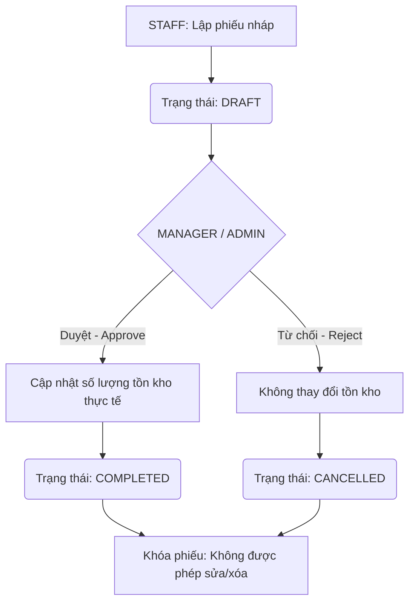

# TÀI LIỆU MÔ TẢ CHI TIẾT NGHIỆP VỤ HỆ THỐNG
## HỆ THỐNG QUẢN LÝ KHO HÀNG ĐA CHI NHÁNH — WAREHUB

---

## 0. LÝ DO RA ĐỜI

### Bối cảnh
Doanh nghiệp đang vận hành **nhiều kho hàng vật lý ở các địa điểm khác nhau**. Khi quy mô mở rộng, việc quản lý thủ công bằng Excel hoặc các phần mềm riêng lẻ tại từng kho phát sinh một loạt vấn đề nghiêm trọng:

### Các vấn đề cần giải quyết

**1. Mất kiểm soát tồn kho liên chi nhánh**
Không có cái nhìn tổng thể về tồn kho toàn hệ thống: không biết chi nhánh nào đang có bao nhiêu hàng, lô nào sắp hết hạn, chỗ nào đang thiếu hàng để điều phối kịp thời.

**2. Không truy vết được trách nhiệm**
Khi xảy ra thất thoát hoặc sai lệch hàng hóa, không có cách nào xác định ai đã thực hiện thao tác gì và vào lúc nào — thiếu audit trail để đối soát.

**3. Rủi ro từ hàng hóa có hạn sử dụng**
Hàng hóa nhập về không được theo dõi theo lô (NSX/HSD), dẫn đến: xuất sai lô, hàng hết hạn vẫn còn trong kho, hoặc phải tiêu hủy hàng loạt do quản lý kém.

**4. Quy trình nhập xuất kho thiếu kiểm soát**
Nhân viên có thể tự ý nhập xuất kho mà không qua phê duyệt của cấp quản lý, dẫn đến số liệu sổ sách không khớp thực tế kho vật lý.

**5. Công nợ đối tác không minh bạch**
Không theo dõi được doanh nghiệp đang nợ nhà cung cấp bao nhiêu, khách hàng đang thiếu bao nhiêu tiền — gây rủi ro tài chính và tranh chấp.

**6. Quản lý nhân sự đa kho phức tạp**
Việc điều chuyển nhân viên giữa các kho không có quy trình rõ ràng, dễ dẫn đến nhầm lẫn quyền truy cập dữ liệu sau khi chuyển.

### Giải pháp WAREHUB mang lại

| Vấn đề | Giải pháp |
| :--- | :--- |
| Dữ liệu phân tán | Tập trung toàn bộ chi nhánh về **một hệ thống duy nhất** |
| Thiếu phân quyền | Cơ chế RBAC 3 cấp: **ADMIN / MANAGER / STAFF** |
| Hàng hết hạn | Theo dõi tồn kho **theo lô hàng (NSX/HSD)**, áp dụng nguyên tắc **FEFO** |
| Không kiểm soát giao dịch | Quy trình phê duyệt **DRAFT → COMPLETED** bắt buộc qua Manager/Admin |
| Không truy vết | **Audit Log** ghi lại toàn bộ thao tác, không ai được sửa/xóa |
| Công nợ mờ | Tự động cập nhật công nợ khi duyệt phiếu UNPAID |
| Điều chuyển nhân sự | Quy trình **3 bước** có xác nhận từ Staff, Manager và Admin |

---

## 1. TỔNG QUAN HỆ THỐNG
Hệ thống quản lý kho hàng đa chi nhánh là giải pháp phần mềm quản lý hàng hóa, giao dịch kho, nhân sự, kiểm kê, đối tác và công nợ tập trung cho doanh nghiệp có nhiều kho hàng vật lý ở các vị trí địa lý khác nhau. Hệ thống hỗ trợ vận hành an toàn bằng cách phân quyền chi tiết, lưu nhật ký hoạt động (Audit Log) và đảm bảo tính toàn vẹn dữ liệu tồn kho bằng kỹ thuật quản lý theo lô sản xuất và hạn sử dụng.

---

## 2. PHÂN QUYỀN TRUY CẬP & MA TRẬN CHỨC NĂNG (RBAC)
Hệ thống sử dụng cơ chế kiểm soát truy cập dựa trên vai trò (Role-Based Access Control). Có 3 nhóm vai trò người dùng chính:
*   **ADMIN (Quản trị viên hệ thống):** Quản lý toàn cục, có toàn quyền trên tất cả các chi nhánh, cấu hình hệ thống, quản lý danh mục và duyệt các yêu cầu điều chuyển nhân sự.
*   **MANAGER (Quản lý chi nhánh):** Điều hành hoạt động của một chi nhánh cụ thể. Chỉ được xem dữ liệu, quản lý nhân viên và duyệt phiếu kho của chi nhánh được gán.
*   **STAFF (Nhân viên kho):** Thực hiện các công việc nghiệp vụ trực tiếp (lập phiếu nháp, kiểm kê) tại chi nhánh của mình. Không có quyền sửa đổi cấu hình hoặc thông tin danh mục hệ thống.

### Ma trận phân quyền chi tiết

| Nhóm Chức Năng | Hành Động | ADMIN | MANAGER (Chi nhánh X) | STAFF (Chi nhánh X) | Ràng Buộc Nghiệp Vụ |
| :--- | :--- | :---: | :---: | :---: | :--- |
| **Xác thực hệ thống**| Đăng nhập, Đăng xuất | ✅ | ✅ | ✅ | Tài khoản ở trạng thái ACTIVE mới được truy cập |
| **Tài khoản cá nhân**| Đổi mật khẩu | ✅ | ✅ | ✅ | Tự thực hiện cho chính mình |
| **Quản lý Người dùng**| CRUD tài khoản nhân viên | ✅ | Chỉ STAFF cùng CN | ❌ | Manager chỉ quản lý Staff cùng chi nhánh. Không tự xóa/khóa chính mình. Không xóa tài khoản đã lập phiếu. |
| **Quản lý Chi nhánh** | CRUD chi nhánh | ✅ | ❌ | ❌ | Admin thao tác toàn cục |
| **Quản lý Danh mục** | CRUD danh mục | ✅ | ❌ | ❌ | Phân loại sản phẩm toàn hệ thống |
| **Quản lý Sản phẩm** | CRUD sản phẩm | ✅ | ✅ | ❌ | Không cho phép sửa `has_expiry` nếu sản phẩm đã có giao dịch |
| **Quản lý Tồn kho** | Xem tồn kho | Tất cả CN | Chỉ CN X | Chỉ CN X | Sắp xếp theo `last_updated` giảm dần |
| | Cấu hình ngưỡng cảnh báo | Toàn cục | Chỉ CN X | Chỉ CN X | Dùng để phát hiện hàng dưới ngưỡng tồn an toàn |
| **Phiếu kho (Receipt)** | Tạo phiếu nháp (DRAFT) | ✅ | ✅ | ✅ | Nhân viên lập phiếu nháp chưa trừ kho |
| | Duyệt phiếu (DRAFT -> COMPLETED) | ✅ | Chỉ CN X | ❌ | Sau khi duyệt mới cộng/trừ kho thực tế |
| | Hủy phiếu (DRAFT -> CANCELLED) | ✅ | Chỉ CN X | ❌ | Không thể sửa/xóa phiếu đã COMPLETED/CANCELLED |
| | Xem lịch sử & chi tiết phiếu | Tất cả | Chỉ CN X | Chỉ CN X | Lọc xem các phiếu kho liên quan chi nhánh (kho xuất hoặc nhận thuộc CN X). |
| **Kiểm kê kho** | Tạo phiên kiểm kê (DRAFT) | ✅ | ✅ | ✅ | Nhập số liệu đếm thực tế |
| | Hoàn tất kiểm kê (COMPLETED) | ✅ | Chỉ CN X | ❌ | Tự động sinh phiếu ADJUST_IN/OUT tương ứng |
| | Hủy phiên kiểm kê (DRAFT -> CANCELLED) | ✅ | Chỉ CN X | ❌ | Hủy bỏ phiên kiểm đếm chưa hoàn tất |
| **Điều chuyển nhân sự**| Gửi yêu cầu chuyển chi nhánh | ❌ | Chỉ CN X | ✅ | Staff tự gửi đơn cho chính mình, hoặc Manager đề xuất. (Admin cập nhật trực tiếp qua CRUD User). |
| | Phê duyệt/Xác nhận yêu cầu | ✅ | Chỉ CN X | ✅ | Staff xác nhận đồng ý (BĐ1), Manager duyệt thông qua (BĐ2), Admin duyệt cuối cùng (BĐ3). |
| **Quản lý Đối tác** | CRUD NCC & Khách hàng | ✅ | ✅ | ❌ | Ghi nhận thông tin liên hệ và công nợ. Đối tác được quản lý toàn cục (không phân chia chi nhánh do cấu trúc DB không có branch_id). |
| | Thanh toán & Cập nhật công nợ | ✅ | Chỉ CN X | ❌ | Cập nhật `payment_status` sang PAID để tự động giảm trừ công nợ tương ứng. |
| **Sao lưu & Phục hồi**| Sao lưu & Phục hồi dữ liệu | ✅ | ❌ | ❌ | Thực hiện trực tiếp trên giao diện quản trị Web (dạng JSON hoặc SQL). |
| **Nhập/Xuất dữ liệu**| Nhập hàng loạt từ Excel | ✅ | ✅ | ❌ | Sử dụng file Excel mẫu để thêm nhanh sản phẩm, nhà cung cấp. |
| | Xuất báo cáo Excel / In PDF | ✅ | Chỉ CN X | Chỉ CN X | Xuất báo cáo xuất-nhập-tồn ra Excel, in hóa đơn giao dịch ra PDF. |
| **Nhật ký hoạt động** | Tra cứu Audit Log | ✅ | ❌ | ❌ | Chỉ Admin truy vết lịch sử thao tác hệ thống |

---

## 3. NGHIỆP VỤ QUẢN LÝ NGƯỜI DÙNG & XÁC THỰC

### 3.1. Xác thực & Quản lý Phiên (Authentication)
*   **Đăng nhập:** Người dùng nhập `username` và `password`. Hệ thống tìm tài khoản trong CSDL, so khớp mật khẩu bằng bộ mã hóa `BCrypt`.
*   **Kiểm tra Trạng thái Tài khoản:**
    *   Tài khoản có trạng thái là `ACTIVE` mới được phép đăng nhập.
    *   Tài khoản có trạng thái `LOCKED` sẽ bị từ chối truy cập và thông báo "Tài khoản bị khóa".
*   **Kiểm tra Hoạt động Liên tục (checkCurrentUserActive):** Trong quá trình sử dụng, với mỗi hành động quan trọng, hệ thống sẽ truy vấn lại trạng thái tài khoản trong DB. Nếu tài khoản bị Admin hoặc Manager khóa (`LOCKED`) giữa phiên làm việc, người dùng sẽ bị ép đăng xuất (force logout) ngay lập tức tại thao tác tiếp theo.
*   **Đăng xuất:** Xóa bỏ thông tin phiên làm việc, đưa người dùng trở lại màn hình đăng nhập.

### 3.2. Quản lý Tài khoản (User CRUD)
*   **Ràng buộc khi Thêm/Sửa Người dùng:**
    *   `username` phải là duy nhất trên toàn hệ thống.
    *   Nhân viên vai trò `MANAGER` và `STAFF` bắt buộc phải được gán vào một chi nhánh cụ thể (`branch_id IS NOT NULL`). Vai trò `ADMIN` bắt buộc phải để trống chi nhánh (`branch_id = NULL`) trên phương diện logic nghiệp vụ để quản trị toàn cục (mặc dù DB check constraint cho phép khác NULL).
    *   Mật khẩu khi lưu vào cơ sở dữ liệu bắt buộc phải được băm bằng thuật toán `BCrypt`. Khi cập nhật thông tin user, nếu để trống trường password thì hệ thống sẽ giữ nguyên mật khẩu cũ.
    *   **Ràng buộc xóa vật lý (Physical Deletion Constraints):** Không cho phép xóa vật lý bất kỳ tài khoản người dùng nào đã phát sinh giao dịch trong hệ thống (được tham chiếu trong bảng `receipts` hoặc `stocktakes` với vai trò người tạo) do ràng buộc khóa ngoại DB (`RESTRICT`). Để vô hiệu hóa tài khoản, quản lý hoặc Admin phải cập nhật trạng thái tài khoản sang `LOCKED`.
*   **Quy tắc phân cấp Quản lý:**
    *   `ADMIN` có quyền CRUD toàn bộ tài khoản bao gồm cả ADMIN khác và các MANAGER, STAFF của tất cả chi nhánh.
    *   `MANAGER` chi nhánh X chỉ có quyền xem, thêm, sửa, khóa hoặc xóa các tài khoản có vai trò `STAFF` trực thuộc chi nhánh X. MANAGER không được nhìn thấy hoặc thao tác với tài khoản ADMIN hoặc tài khoản của chi nhánh khác.
    *   `STAFF` hoàn toàn không có quyền truy cập module Quản lý người dùng.
*   **Quy tắc tự bảo vệ:**
    *   Người dùng không được tự khóa tài khoản của chính mình (`status = LOCKED`).
    *   Người dùng không được tự xóa tài khoản của chính mình.
    *   ADMIN không được tự hạ vai trò (Role) của mình xuống vai trò thấp hơn nếu tài khoản đó đang đăng nhập.

---

## 4. NGHIỆP VỤ QUẢN LÝ CHI NHÁNH (BRANCH MANAGEMENT)
*   **Thêm chi nhánh mới:** Cần nhập tên chi nhánh (duy nhất) và địa chỉ chi tiết. Ngưỡng báo động tồn kho thấp mặc định là `5` sản phẩm nếu không cấu hình khác.
*   **Cập nhật chi nhánh:** Cho phép chỉnh sửa tên (check trùng lặp ngoại trừ chính nó), địa chỉ và ngưỡng báo động. Sau khi lưu, hệ thống phải cập nhật lập tức danh sách chi nhánh hiển thị trong các ComboBox lọc trên toàn ứng dụng.
*   **Xóa chi nhánh:** Chỉ cho phép xóa khi chi nhánh đó **không có bất kỳ liên kết dữ liệu nào** (không có nhân viên, không có sản phẩm tồn kho, không có phiếu kho liên quan). Ràng buộc khóa ngoại ở mức DB là `RESTRICT` để tránh mất dữ liệu liên đới.

---

## 5. NGHIỆP VỤ QUẢN LÝ SẢN PHẨM & DANH MỤC

### 5.1. Danh mục sản phẩm (Category)
*   Quản lý danh mục phục vụ việc phân loại hàng hóa (ví dụ: Điện thoại, Laptop, Thực phẩm).
*   Tên danh mục phải là duy nhất. Khi xóa danh mục, CSDL sẽ chặn lại bằng ràng buộc ngoại (`RESTRICT`) nếu đang có sản phẩm thuộc danh mục đó.

### 5.2. Sản phẩm (Product)
*   **Mã sản phẩm (`code`):** Phải là duy nhất và bắt buộc viết hoa (ví dụ: `IP15PRO`). Hệ thống sẽ tự động chuyển thành chữ hoa trước khi kiểm tra trùng lặp và lưu.
*   **Đơn giá (`price`):** Phải lớn hơn hoặc bằng `0`.
*   **Quản lý Hạn sử dụng (Expiry Rules):**
    *   Nếu sản phẩm có quản lý HSD (`has_expiry = true`): Bắt buộc phải có ngày sản xuất (`mfg_date`) và hạn sử dụng (`exp_date`). Đồng thời phải thỏa mãn điều kiện ngày sản xuất nhỏ hơn hoặc bằng hạn sử dụng (`exp_date >= mfg_date`).
    *   Nếu sản phẩm không quản lý HSD (`has_expiry = false`): Hệ thống tự động thiết lập ngày sản xuất và hạn sử dụng về giá trị mặc định là `1970-01-01`. Khi hiển thị lên giao diện sẽ được thay thế bằng dấu gạch ngang (`-`).
*   **Quy tắc cập nhật đặc biệt:** Không cho phép thay đổi thuộc tính `has_expiry` của sản phẩm một khi sản phẩm đó đã phát sinh số lượng tồn kho hoặc đã xuất hiện trong bất kỳ chi tiết phiếu giao dịch nào. Điều này nhằm tránh phá vỡ cấu trúc khóa tồn kho.

---

## 6. NGHIỆP VỤ QUẢN LÝ TỒN KHO THEO LÔ (INVENTORY BY LOT)

### 6.1. Cấu trúc Khóa Tồn kho
*   Tồn kho được theo dõi chi tiết đến từng lô hàng. Khóa chính/Khóa nghiệp vụ duy nhất (Composite Unique Key) của bảng tồn kho gồm 4 trường: `(branch_id, product_id, mfg_date, exp_date)`.
*   Một sản phẩm có thể xuất hiện nhiều dòng trong kho của một chi nhánh nếu chúng thuộc các lô sản xuất hoặc có ngày hạn sử dụng khác nhau.

### 6.2. Cảnh báo tồn kho thấp & Hạn sử dụng
*   **Ngưỡng tồn kho thấp:** Hệ thống so sánh tổng số lượng tồn kho của một sản phẩm tại chi nhánh với ngưỡng `low_stock_threshold` của chi nhánh đó. Nếu số lượng tồn kho $\le$ ngưỡng cấu hình, dòng sản phẩm đó trên giao diện sẽ được đánh dấu cảnh báo (highlight đỏ). Đối với tài khoản ADMIN khi chọn chế độ xem tồn kho của "Tất cả chi nhánh", hệ thống sẽ sử dụng một ngưỡng cảnh báo tồn kho toàn cục (được lưu tại Preferences của ứng dụng khách) để làm căn cứ đánh dấu cảnh báo.
*   **Quản lý hạn sử dụng:**
    *   Hệ thống cung cấp chức năng lọc danh sách các lô hàng sắp hết hạn (HSD nằm trong khoảng cảnh báo $N$ ngày) hoặc đã hết hạn để thủ kho xử lý tiêu hủy/trả hàng.
    *   Nguyên tắc xuất kho FEFO (First-Expired-First-Out) bắt buộc áp dụng cho các sản phẩm có quản lý hạn sử dụng: Lô hàng nào có HSD gần nhất sẽ được hệ thống gợi ý chọn để xuất trước. Đối với các sản phẩm không quản lý hạn sử dụng (mặc định HSD `1970-01-01`), hệ thống sẽ gợi ý xuất theo thứ tự lô nhập trước xuất trước (FIFO).

---

## 7. NGHIỆP VỤ PHIẾU KHO & GIAO DỊCH KHO (RECEIPT TRANSACTION)

### 7.1. Mã phiếu kho tự sinh
Mã phiếu kho được sinh tự động theo quy tắc: **2 ký tự tiền tố loại phiếu** + **8 ký tự UUID ngẫu nhiên**. 
*   *IMPORT:* `IM...`
*   *EXPORT:* `EX...`
*   *TRANSFER:* `TR...`
*   *ADJUST_IN:* `AI...` (hoặc `AD...`)
*   *ADJUST_OUT:* `AO...`
*   *Quy trình chống trùng mã:* Hệ thống sẽ thử sinh mã tối đa 5 lần. Nếu vẫn trùng (tỷ lệ cực thấp), hệ thống sẽ dùng cơ chế dự phòng là ghép chuỗi Timestamp để đảm bảo tính duy nhất tuyệt đối.

### 7.2. Quy trình lập và Duyệt phiếu kho (Approval Workflow)
Mọi phiếu kho đều đi qua quy trình kiểm soát chặt chẽ nhằm tránh sai lệch tồn kho do nhập liệu sai:

1.  **Lập phiếu nháp (DRAFT):**
    *   Nhân viên thêm sản phẩm, chọn lô (NSX/HSD), nhập số lượng và đơn giá giao dịch.
    *   Hệ thống kiểm tra tính hợp lệ: Số lượng nhập/xuất phải $> 0$. Đối với phiếu xuất (`EXPORT`, `TRANSFER`), số lượng xuất không được vượt quá số lượng tồn kho khả dụng của lô hàng đó tại chi nhánh xuất (bao gồm cả việc trừ đi các dòng nháp khác trong cùng phiếu).
    *   **Tồn kho thực tế chưa thay đổi** khi phiếu ở trạng thái DRAFT. Phiếu DRAFT có thể được sửa đổi nội dung hoặc xóa hoàn toàn.
2.  **Phê duyệt phiếu (COMPLETED):**
    *   Chỉ `MANAGER` trực thuộc chi nhánh đó hoặc `ADMIN` mới có nút duyệt phiếu.
    *   Khi duyệt phiếu, hệ thống tiến hành cập nhật số lượng tồn kho thực tế trong CSDL dưới một giao dịch duy nhất (`@Transactional`). Nếu bất kỳ lô hàng nào không đủ số lượng để trừ (do có biến động kho trước đó), toàn bộ thao tác duyệt sẽ bị rollback, thông báo lỗi và giữ nguyên trạng thái phiếu.
    *   Sau khi duyệt thành công, trạng thái chuyển sang `COMPLETED` và phiếu bị khóa hoàn toàn.
3.  **Từ chối/Hủy phiếu (CANCELLED):**
    *   Nếu thông tin phiếu nháp không chính xác, người quản lý có thể hủy phiếu. Trạng thái chuyển sang `CANCELLED`, tồn kho giữ nguyên và phiếu bị khóa.

### 7.3. Logic Cập nhật Tồn kho chi tiết theo loại phiếu
*   **IMPORT / ADJUST_IN (Nhập kho / Cân bằng tăng):**
    *   Kiểm tra lô hàng `(dest_branch_id, product_id, mfg_date, exp_date)` đã tồn tại trong bảng `inventories` chưa.
    *   Nếu chưa: Tạo mới bản ghi tồn kho với số lượng bằng số lượng nhập.
    *   Nếu có rồi: Cộng dồn số lượng nhập vào số lượng hiện tại.
    *   Cập nhật thời gian `last_updated = CURRENT_TIMESTAMP`.
*   **EXPORT / ADJUST_OUT (Xuất kho / Cân bằng giảm):**
    *   Kiểm tra lô hàng tại `source_branch_id` phải tồn tại trong bảng `inventories`.
    *   So sánh số lượng tồn hiện tại với số lượng cần xuất. Nếu tồn kho không đủ, chặn giao dịch và ném lỗi `Không đủ tồn kho`.
    *   Trừ số lượng tồn kho tương ứng. Nếu tồn kho sau khi trừ bằng `0`, bản ghi lô tồn kho vẫn được giữ lại với số lượng là `0` để lưu vết lịch sử lô (hoặc có thể xóa tùy theo cấu hình hệ thống).
    *   Cập nhật thời gian `last_updated = CURRENT_TIMESTAMP`.
*   **TRANSFER (Điều chuyển chi nhánh 2 bước):**
    *   **Bước 1 (Xuất điều chuyển):** Khi phiếu xuất đi được phê duyệt, hệ thống trừ số lượng tồn kho tại chi nhánh nguồn (`source_branch_id`), đồng thời lưu trạng thái `payment_status` là `'IN_TRANSIT'` (Đang đi đường). Hàng hóa tạm thời bị trừ khỏi kho nguồn nhưng chưa được cộng vào kho đích.
    *   **Bước 2 (Xác nhận nhập):** Khi hàng hóa thực tế tới chi nhánh đích, nhân viên tại chi nhánh đích thực hiện đếm thực tế và bấm Xác nhận nhận hàng. Hệ thống cộng số lượng nhận thực tế vào tồn kho của chi nhánh đích (`dest_branch_id`), đồng thời chuyển trạng thái `payment_status` của phiếu thành `'RECEIVED'` (Đã nhận hàng) để hoàn tất phiếu.
    *   **Xử lý hao hụt vận chuyển:** Nếu số lượng nhận thực tế ít hơn số lượng xuất đi, hệ thống tự động ghi nhận lượng hao hụt và sinh một phiếu cân bằng giảm (`ADJUST_OUT` ở trạng thái `COMPLETED`) tại chi nhánh nguồn tương ứng với số lượng chênh lệch hao hụt để đảm bảo tính nhất quán của số liệu sổ sách.
    *   **Lưu ý kỹ thuật về số lượng:** Do bảng `receipt_details` chỉ có một trường `quantity` lưu số lượng xuất, hệ thống không lưu trữ số lượng thực nhận trực tiếp trên chi tiết phiếu điều chuyển gốc. Số lượng gốc xuất đi vẫn được giữ nguyên ở phiếu `TRANSFER` để làm cơ sở đối chiếu, còn lượng hao hụt sẽ được quản lý gián tiếp qua phiếu `ADJUST_OUT` tự động sinh nói trên.

---

## 8. NGHIỆP VỤ KIỂM KÊ KHO (STOCKTAKE)
Kiểm kê kho là nghiệp vụ định kỳ của chi nhánh để đối chiếu và sửa sai lệch giữa sổ sách phần mềm và thực tế hàng hóa trong kho.
*   **Khởi tạo phiên kiểm kê:** STAFF tạo một phiếu kiểm kê mới cho chi nhánh của mình ở trạng thái `DRAFT`. Mã phiên kiểm kê được tự động sinh theo quy tắc: **tiền tố ST + 8 ký tự UUID ngẫu nhiên** (ví dụ: `STa1b2c3d4`), cơ chế phòng tránh trùng tương tự như phiếu kho.
*   **Nhập số liệu thực tế:** Nhân viên tiến hành kiểm đếm thực tế từng lô hàng và nhập số lượng vào cột `actual_quantity`. Hệ thống sẽ tự động hiển thị số lượng tồn kho sổ sách hiện tại (`expected_quantity`) để đối chiếu chênh lệch.
*   **Ràng buộc kiểm soát giao dịch song song:** Để tránh sai lệch số liệu kiểm kê tự động, trong thời gian phiên kiểm kê đang ở trạng thái `DRAFT`, hệ thống khuyến nghị khóa việc phê duyệt các phiếu kho (nhập, xuất, điều chuyển) liên quan đến chi nhánh đó. Nếu không khóa, hệ thống bắt buộc phải cập nhật lại (re-snapshot) trường `expected_quantity` dựa trên tồn kho thực tế ngay trước khi chuyển trạng thái kiểm kê sang `COMPLETED`.
*   **Xác nhận hoàn tất kiểm kê (Duyệt kiểm kê):**
    *   Chỉ `MANAGER` hoặc `ADMIN` mới có quyền chuyển trạng thái phiên kiểm kê từ `DRAFT` sang `COMPLETED`.
    *   Khi hoàn tất phiên kiểm kê, hệ thống tính toán chênh lệch cho từng dòng chi tiết:
        *   Nếu `actual_quantity` > `expected_quantity`: Hệ thống **tự động sinh ra một phiếu cân bằng tăng (`ADJUST_IN`)** ở trạng thái `COMPLETED` với số lượng chênh lệch và liên kết ID phiếu này vào cột `adjustment_receipt_id` của chi tiết kiểm kê. Tồn kho thực tế tăng lên.
        *   Nếu `actual_quantity` < `expected_quantity`: Hệ thống **tự động sinh ra một phiếu cân bằng giảm (`ADJUST_OUT`)** ở trạng thái `COMPLETED` với số lượng chênh lệch và liên kết ID phiếu. Tồn kho thực tế giảm đi.
        *   Nếu bằng nhau: Không sinh phiếu điều chỉnh.

---

## 9. NGHIỆP VỤ ĐIỀU CHUYỂN NHÂN SỰ 3 BƯỚC (3-STEP STAFF TRANSFER)
Nhằm quản lý biến động nhân sự giữa các kho hàng vật lý và đảm bảo sự đồng thuận từ các bên:
*   **Bước 1: Đề xuất & Xác nhận từ Nhân viên:** 
    *   Yêu cầu điều động có thể do `MANAGER` tạo, nhưng hệ thống sẽ yêu cầu tài khoản của `STAFF` đó phải thực hiện **Xác nhận đồng ý** trên giao diện Web của mình. 
    *   Nếu nhân viên tự làm đơn xin chuyển, đơn cũng sẽ được tạo và ghi nhận trạng thái khởi đầu là `STAFF_CONFIRMED` (đã có sự xác nhận từ nhân viên).
*   **Bước 2: Manager thông qua:**
    *   Quản lý (`MANAGER`) của chi nhánh hiện tại tiến hành phê duyệt để xác nhận việc bàn giao công việc hoàn tất. 
    *   Trạng thái chuyển sang `MANAGER_APPROVED`.
*   **Bước 3: Admin phê duyệt quyết định:**
    *   Chỉ có `ADMIN` hệ thống mới có quyền đưa ra quyết định phê duyệt cuối cùng (`APPROVED`) hoặc từ chối (`REJECTED`).
    *   Nếu chọn **APPROVED (Duyệt):** Hệ thống tự động cập nhật trường `branch_id` của nhân viên đó trong bảng `users` sang chi nhánh mới (`to_branch_id`), cập nhật ngày duyệt và người duyệt. Từ thời điểm này, nhân viên đó chỉ có quyền đăng nhập và thao tác dữ liệu của chi nhánh mới.
    *   Nếu chọn **REJECTED (Từ chối):** Đơn chuyển sang trạng thái hủy, nhân viên tiếp tục làm việc tại chi nhánh cũ.
*   **Lưu ý CSDL về phê duyệt trung gian:** Do bảng `branch_transfer_requests` chỉ lưu vết người phê duyệt cuối cùng ở trường `approved_by` (chỉ dành cho Admin), bước phê duyệt trung gian ở bước 2 của Manager không được lưu bằng cột riêng trong bảng này mà được ghi nhận thông qua việc cập nhật `status = 'MANAGER_APPROVED'` và được lưu vết chi tiết trong bảng `audit_logs`.

---

## 10. NGHIỆP VỤ SAO LƯU & PHỤC HỒI TRÊN WEB (WEB-BASED BACKUP & RESTORE)
Để phục vụ công tác quản trị và lưu trữ dữ liệu an toàn trực tiếp từ trình duyệt mà không cần sử dụng công cụ quản trị CSDL chuyên dụng:
*   **Sao lưu dữ liệu (Backup):**
    *   `ADMIN` kích hoạt chức năng sao lưu trên giao diện quản trị Web.
    *   Hệ thống backend truy vấn dữ liệu từ các bảng PostgreSQL, serialize thành file dạng JSON hoặc SQL và tự động kích hoạt tiến trình tải xuống thông qua trình duyệt để lưu trên máy tính cá nhân.
*   **Phục hồi dữ liệu (Restore):**
    *   `ADMIN` tải lên file sao lưu (.json hoặc .sql) từ máy tính thông qua form nhập file trên giao diện Web.
    *   Backend nhận file, phân tích dữ liệu và tự động nạp đè vào PostgreSQL dưới một transaction bảo mật.

---

## 11. NGHIỆP VỤ QUẢN LÝ ĐỐI TÁC & CÔNG NỢ (PARTNERS & FINANCE)

### 11.1. Nhà cung cấp (Suppliers)
*   Lưu thông tin: Tên công ty, thông tin liên lạc, địa chỉ, trạng thái hoạt động (`ACTIVE`/`INACTIVE`) và công nợ (`debt`).
*   **Tác động công nợ:** Khi duyệt một phiếu nhập kho (`IMPORT`) có trạng thái thanh toán là `UNPAID`, hệ thống sẽ tự động cộng giá trị hóa đơn (Tổng số lượng $\times$ Đơn giá giao dịch của các dòng chi tiết) vào công nợ của Nhà cung cấp đó (`suppliers.debt += total_receipt_value`). Khi kho thực hiện trả tiền cho NCC, thủ kho sẽ cập nhật trạng thái thanh toán của phiếu nhập tương ứng sang `PAID` và hệ thống sẽ trừ công nợ tương ứng.
*   **Ràng buộc xóa vật lý:** Không cho phép xóa vật lý bất kỳ Nhà cung cấp nào đã có liên kết giao dịch trong bảng `receipts` (khóa ngoại `RESTRICT`). Thủ kho hoặc quản lý chỉ có thể cập nhật trạng thái hoạt động sang `INACTIVE` để ngưng hợp tác.

### 11.2. Khách hàng (Customers)
*   Lưu thông tin: Họ tên, số điện thoại, địa chỉ, trạng thái hoạt động và công nợ (`debt`).
*   **Tác động công nợ:** Khi duyệt một phiếu xuất kho (`EXPORT`) có trạng thái thanh toán là `UNPAID`, hệ thống tự động cộng giá trị hóa đơn xuất vào số nợ khách hàng phải trả cho doanh nghiệp (`customers.debt += total_receipt_value`). Khi khách hàng thanh toán xong, phiếu xuất chuyển sang trạng thái `PAID` và nợ của khách hàng được giảm trừ tương ứng.
*   **Ràng buộc xóa vật lý:** Tương tự Nhà cung cấp, không cho phép xóa vật lý Khách hàng đã phát sinh giao dịch (khóa ngoại `RESTRICT`), chỉ được chuyển trạng thái sang `INACTIVE`.

### 11.3. Hạn chế trong quản lý Thanh toán & Công nợ
*   **Thanh toán công nợ đơn giản:** Hệ thống quản lý công nợ ở mức tổng hợp dựa trên cờ trạng thái `payment_status` (`UNPAID` / `PAID`) của phiếu kho và cộng dồn vào cột `debt`. Hệ thống không lưu trữ chi tiết lịch sử giao dịch thanh toán hoặc hỗ trợ thanh toán một phần (partial payment) do cấu trúc CSDL hiện tại chưa hỗ trợ bảng thanh toán riêng.

---

## 12. NGHIỆP VỤ NHẬT KÝ HOẠT ĐỘNG (AUDIT LOGGING)
*   Bảng `audit_logs` đóng vai trò là bằng chứng giám sát (Audit Trail). Hệ thống không cho phép bất kỳ ai (kể cả ADMIN) được quyền chỉnh sửa hoặc xóa dữ liệu trong bảng này.
*   **Các hành động bắt buộc phải ghi log:**
    *   `LOGIN` / `LOGOUT`: Đăng nhập thành công, đăng nhập thất bại, đăng xuất.
    *   `CREATE` / `UPDATE` / `DELETE` trên các bảng cấu hình: `users`, `products`, `branches`, `categories`, `suppliers`, `customers`.
    *   `DRAFT` / `APPROVE` / `CANCEL` trên các bảng giao dịch: `receipts`, `stocktakes`.
    *   `CREATE` / `CONFIRM` / `APPROVE` / `REJECT` trên quy trình điều chuyển nhân sự (`branch_transfer_requests`).
    *   `LOCK` / `UNLOCK`: Khóa hoặc mở khóa tài khoản người dùng.
*   **Nội dung chi tiết (`details`):** Ghi rõ trạng thái trước và sau khi thay đổi dưới dạng văn bản mô tả hoặc định dạng JSON của đối tượng bị thay đổi nhằm phục vụ công tác đối soát khi xảy ra thất thoát hàng hóa.
*   **Lưu ý kỹ thuật về bảo mật Log:** Quy tắc không cho phép sửa/xóa bảng nhật ký hoạt động được kiểm soát và thực thi chặt chẽ ở mức logic nghiệp vụ phần mềm (Application Level), do CSDL PostgreSQL hiện tại chưa cấu hình trigger chặn thao tác này trực tiếp trên DB.

---

## 13. CÁC QUY TẮC HIỂN THỊ & KỸ THUẬT QUAN TRỌNG
*   **Định dạng Tiền tệ:** Tiền tệ luôn được định dạng theo Locale của Đức (GERMANY) với dấu chấm làm phân cách hàng nghìn (ví dụ: `29.900.000 VNĐ`). Mẫu định dạng: `#,##0`.
*   **Định dạng Ngày tháng:** Hiển thị thống nhất theo chuẩn Việt Nam: `dd/MM/yyyy` (ví dụ: `11/06/2026`).
*   **Giao dịch an toàn Database:** Toàn bộ logic cập nhật số lượng tồn kho của phiếu kho và kiểm kê bắt buộc phải chạy trong môi trường Spring `@Transactional` với chính sách rollback mọi ngoại lệ (`rollbackFor = Exception.class`).
