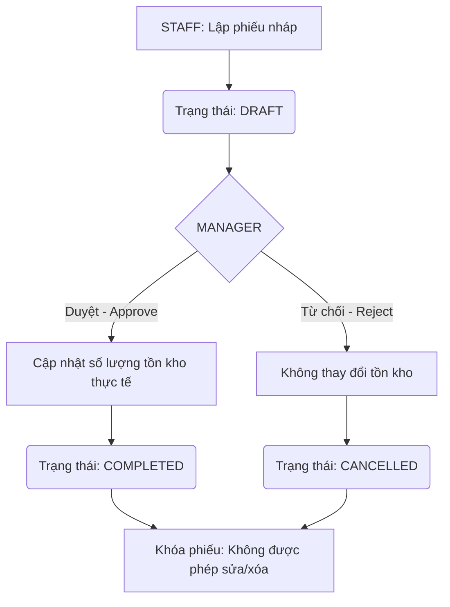

# TÀI LIỆU MÔ TẢ CHI TIẾT NGHIỆP VỤ HỆ THỐNG
## HỆ THỐNG QUẢN LÝ KHO HÀNG ĐA CHI NHÁNH — WAREHUB

---

## 0. LÝ DO RA ĐỜI

### Bối cảnh
Doanh nghiệp vận hành theo mô hình **một chi nhánh tổng (kho trung tâm) phân phối hàng hóa cho nhiều chi nhánh con**. Khi quy mô mở rộng, quản lý thủ công bằng Excel phát sinh các vấn đề nghiêm trọng:

### Các vấn đề cần giải quyết

**1. Mất kiểm soát tồn kho liên chi nhánh**
Không biết kho tổng còn bao nhiêu hàng, chi nhánh con nào đang cần bổ sung, lô nào sắp hết hạn để điều phối kịp thời.

**2. Không truy vết được trách nhiệm**
Khi xảy ra thất thoát hàng hóa, không có cách nào xác định ai đã thao tác gì và vào lúc nào.

**3. Rủi ro từ hàng hóa có hạn sử dụng**
Hàng hóa không được theo dõi theo lô (NSX/HSD), dẫn đến xuất sai lô hoặc hàng hết hạn vẫn còn trong kho.

**4. Quy trình nhập xuất kho thiếu kiểm soát**
Nhân viên tự ý nhập xuất kho mà không qua phê duyệt của cấp quản lý, dẫn đến số liệu sổ sách không khớp thực tế.

**5. Công nợ khách hàng không minh bạch**
Không theo dõi được khách hàng đang thiếu bao nhiêu tiền — gây rủi ro tài chính và tranh chấp.

### Giải pháp WAREHUB mang lại

| Vấn đề | Giải pháp |
| :--- | :--- |
| Dữ liệu phân tán | Tập trung toàn bộ chi nhánh về **một hệ thống duy nhất** |
| Thiếu phân quyền | Cơ chế RBAC 3 cấp: **ADMIN / MANAGER / STAFF** |
| Hàng hết hạn | Theo dõi tồn kho **theo lô hàng (NSX/HSD)**, áp dụng nguyên tắc **FEFO** |
| Không kiểm soát giao dịch | Quy trình phê duyệt **DRAFT → COMPLETED** bắt buộc qua Manager |
| Không truy vết | **Audit Log** ghi lại toàn bộ thao tác, không ai được sửa/xóa |
| Công nợ mờ | Tự động cập nhật công nợ khi duyệt phiếu UNPAID |
| Phân phối hàng hóa | Mô hình **Chi nhánh Tổng → Chi nhánh Con** với phiếu TRANSFER trừ kho tổng, cộng kho con |

---

## 1. TỔNG QUAN HỆ THỐNG

Hệ thống quản lý kho hàng đa chi nhánh WAREHUB là giải pháp phần mềm quản lý hàng hóa, giao dịch kho, kiểm kê và công nợ khách hàng tập trung cho doanh nghiệp vận hành theo mô hình **chi nhánh tổng — chi nhánh con**. Chi nhánh tổng đóng vai trò kho trung tâm, nhập hàng vào và phân phối xuống các chi nhánh con. Hệ thống hỗ trợ vận hành an toàn bằng cách phân quyền chi tiết, lưu nhật ký hoạt động (Audit Log) và đảm bảo tính toàn vẹn dữ liệu tồn kho bằng kỹ thuật quản lý theo lô sản xuất và hạn sử dụng.

---

## 2. MÔ HÌNH CHI NHÁNH TỔNG & CHI NHÁNH CON

### 2.1. Định nghĩa
*   **Chi nhánh Tổng (Head Branch):** Kho trung tâm của doanh nghiệp. Nhận hàng đầu vào (phiếu `IMPORT`) và phân phối hàng cho các chi nhánh con thông qua phiếu `TRANSFER`. Quản lý bởi một `MANAGER` riêng.
*   **Chi nhánh Con (Sub-Branch):** Kho vệ tinh tại các địa điểm khác. Nhận hàng từ chi nhánh tổng (thông qua `TRANSFER`), bán hàng cho khách hàng (phiếu `EXPORT`). Quản lý bởi `MANAGER` của chi nhánh đó.

### 2.2. Luồng hàng hóa chính

```
[Nhập hàng vào kho tổng]          [Phân phối xuống chi nhánh con]         [Bán hàng cho khách]
       IMPORT                              TRANSFER                              EXPORT
Chi nhánh Tổng (+)       →      Tổng (-) / Chi nhánh Con (+)      →       Chi nhánh Con (-)
```

### 2.3. Quy tắc TRANSFER trong mô hình tổng — con
*   Phiếu `TRANSFER` được lập bởi **STAFF của chi nhánh nguồn (tổng)**, duyệt bởi **MANAGER của chi nhánh nguồn**.
*   Khi duyệt: **trừ số lượng tồn kho tại chi nhánh tổng** (nguồn), **cộng số lượng vào tồn kho chi nhánh con** (đích).
*   Chi tiết xử lý hao hụt vận chuyển và xác nhận nhận hàng: xem Mục 7.

---

## 3. PHÂN QUYỀN TRUY CẬP & MA TRẬN CHỨC NĂNG (RBAC)

Hệ thống sử dụng cơ chế kiểm soát truy cập dựa trên vai trò (Role-Based Access Control). Có 3 nhóm vai trò:

*   **ADMIN (Quản trị viên hệ thống):** Quản lý hệ thống ở tầng hạ tầng — tài khoản người dùng và chi nhánh. ADMIN **không tham gia vào nghiệp vụ kho hàng** (không thao tác phiếu kho, tồn kho, kiểm kê, sao lưu hay nhật ký).
*   **MANAGER (Quản lý chi nhánh):** Điều hành toàn bộ nghiệp vụ của chi nhánh được gán — quản lý danh mục, sản phẩm, khách hàng, duyệt phiếu kho, hoàn tất kiểm kê, sao lưu và xem nhật ký của chi nhánh mình.
*   **STAFF (Nhân viên kho):** Thực hiện các công việc nghiệp vụ trực tiếp — lập phiếu nháp, nhập số liệu kiểm kê, cấu hình ngưỡng cảnh báo tồn kho. Không có quyền duyệt, hủy hoặc truy cập cấu hình hệ thống.

### Ma trận phân quyền chi tiết

| Nhóm Chức Năng | Hành Động | ADMIN | MANAGER (Chi nhánh X) | STAFF (Chi nhánh X) | Ràng Buộc Nghiệp Vụ |
| :--- | :--- | :---: | :---: | :---: | :--- |
| **Xác thực hệ thống** | Đăng nhập, Đăng xuất | ✅ | ✅ | ✅ | Tài khoản ở trạng thái ACTIVE mới được truy cập |
| **Tài khoản cá nhân** | Đổi mật khẩu | ✅ | ✅ | ✅ | Tự thực hiện cho chính mình |
| **Quản lý Người dùng** | CRUD tài khoản nhân viên | ✅ | Chỉ STAFF cùng CN | ❌ | Manager chỉ quản lý Staff cùng chi nhánh. Không tự xóa/khóa chính mình. |
| **Quản lý Chi nhánh** | CRUD chi nhánh | ✅ | ❌ | ❌ | Admin thao tác toàn cục |
| **Quản lý Danh mục** | CRUD danh mục | ✅ | ✅ | ❌ | Admin & Manager quản lý toàn hệ thống |
| **Quản lý Sản phẩm** | CRUD sản phẩm | ✅ | ✅ | ❌ | Khi tạo sản phẩm, bắt buộc khởi tạo tồn kho bằng 0 tại Kho Tổng |
| **Quản lý Tồn kho** | Xem tồn kho | ✅ Xem toàn bộ, quản lý tại CN Tổng | Chỉ CN X | Chỉ CN X | Admin quản lý tồn kho với tư cách quản lý của Kho Tổng |
| | Cấu hình ngưỡng cảnh báo | ✅ Chỉ Kho Tổng | ✅ Chỉ CN X | ✅ Chỉ CN X | Admin cấu hình ngưỡng cho Kho Tổng |
| **Phiếu kho (Receipt)** | Tạo phiếu nháp (DRAFT) | ✅ `IMPORT` và `TRANSFER` tại Kho Tổng | ❌ | ✅ Chỉ CN X | Admin đóng vai trò lập phiếu nhập/xuất tại Kho Tổng |
| | Duyệt phiếu (DRAFT → COMPLETED) | ✅ Tại Kho Tổng | ✅ Chỉ CN X | ❌ | Admin duyệt phiếu tại Kho Tổng |
| | Hủy phiếu (DRAFT → CANCELLED) | ✅ Tại Kho Tổng | ✅ Chỉ CN X | ❌ | Không thể sửa/xóa phiếu đã COMPLETED/CANCELLED |
| | Xem lịch sử & chi tiết phiếu | ❌ | ✅ Chỉ CN X | ✅ Chỉ CN X | Lọc theo chi nhánh xuất hoặc nhận thuộc CN X |
| **Kiểm kê kho** | Tạo phiên kiểm kê (DRAFT) & nhập số liệu | ❌ | ✅ Chỉ CN X | ✅ Chỉ CN X | Staff nhập số lượng thực tế |
| | Hoàn tất kiểm kê (COMPLETED) | ❌ | ✅ Chỉ CN X | ❌ | Tự động sinh phiếu ADJUST_IN/OUT tương ứng |
| | Hủy phiên kiểm kê (DRAFT → CANCELLED) | ❌ | ✅ Chỉ CN X | ❌ | Hủy bỏ phiên kiểm đếm chưa hoàn tất |
| **Quản lý Khách hàng** | CRUD khách hàng | ❌ | ✅ | ❌ | Manager quản lý toàn cục, không phân chia chi nhánh |
| | Cập nhật công nợ | ❌ | ✅ Chỉ CN X | ❌ | Cập nhật `payment_status` sang PAID để giảm công nợ |
| **Sao lưu & Phục hồi** | Sao lưu & Phục hồi dữ liệu | ❌ | ✅ Chỉ dữ liệu CN X | ❌ | Manager chỉ sao lưu/phục hồi dữ liệu của chi nhánh mình |
| **Nhập/Xuất dữ liệu** | Nhập hàng loạt từ Excel | ❌ | ✅ Chỉ CN X | ❌ | Manager nhập dữ liệu cho chi nhánh mình |
| | Xuất báo cáo Excel / In PDF | ❌ | ✅ Chỉ CN X | ✅ Chỉ CN X | Xuất báo cáo xuất-nhập-tồn ra Excel, in phiếu giao dịch ra PDF |
| **Nhật ký hoạt động** | Tra cứu Audit Log | ❌ | ✅ Chỉ CN X | ❌ | Manager chỉ xem log của chi nhánh mình, không xem log của chi nhánh khác |

---

## 4. NGHIỆP VỤ QUẢN LÝ NGƯỜI DÙNG & XÁC THỰC

### 4.1. Xác thực & Quản lý Phiên (Authentication)
*   **Đăng nhập:** Người dùng nhập `username` và `password`. Hệ thống tìm tài khoản trong CSDL, so khớp mật khẩu bằng bộ mã hóa `BCrypt`.
*   **Kiểm tra Trạng thái Tài khoản:**
    *   Tài khoản có trạng thái `ACTIVE` mới được phép đăng nhập.
    *   Tài khoản `LOCKED` sẽ bị từ chối truy cập và thông báo "Tài khoản bị khóa".
*   **Kiểm tra Hoạt động Liên tục (checkCurrentUserActive):** Với mỗi hành động quan trọng, hệ thống truy vấn lại trạng thái tài khoản trong DB. Nếu tài khoản bị khóa (`LOCKED`) giữa phiên làm việc, người dùng sẽ bị ép đăng xuất (force logout) ngay lập tức.
*   **Đăng xuất:** Xóa bỏ thông tin phiên làm việc.

### 4.2. Quản lý Tài khoản (User CRUD)
*   **Ràng buộc khi Thêm/Sửa Người dùng:**
    *   `username` phải là duy nhất trên toàn hệ thống.
    *   `MANAGER` và `STAFF` bắt buộc phải được gán vào một chi nhánh cụ thể (`branch_id IS NOT NULL`). `ADMIN` bắt buộc để trống chi nhánh (`branch_id = NULL`) để quản trị toàn cục.
    *   Mật khẩu bắt buộc được băm bằng `BCrypt`. Nếu để trống trường password khi cập nhật, hệ thống giữ nguyên mật khẩu cũ.
    *   **Ràng buộc xóa vật lý:** Không cho phép xóa tài khoản đã phát sinh giao dịch (`receipts`, `stocktakes`). Thay vào đó cập nhật trạng thái sang `LOCKED`.
*   **Quy tắc phân cấp Quản lý:**
    *   `ADMIN` có quyền CRUD toàn bộ tài khoản.
    *   `MANAGER` chi nhánh X chỉ có quyền xem, thêm, sửa, khóa/xóa tài khoản `STAFF` trực thuộc chi nhánh X.
    *   `STAFF` hoàn toàn không có quyền truy cập module Quản lý người dùng.
*   **Quy tắc tự bảo vệ:**
    *   Người dùng không được tự khóa hoặc tự xóa tài khoản của chính mình.
    *   ADMIN không được tự hạ vai trò của mình khi đang đăng nhập.

---

## 5. NGHIỆP VỤ QUẢN LÝ CHI NHÁNH (BRANCH MANAGEMENT)

*   **Thêm chi nhánh mới:** Cần nhập tên chi nhánh (duy nhất) và địa chỉ chi tiết. Ngưỡng báo động tồn kho thấp mặc định là `5` nếu không cấu hình khác.
*   **Cập nhật chi nhánh:** Cho phép chỉnh sửa tên (check trùng lặp), địa chỉ và ngưỡng báo động. Sau khi lưu, hệ thống cập nhật lập tức danh sách chi nhánh trong các ComboBox lọc toàn ứng dụng.
*   **Xóa chi nhánh:** Chỉ cho phép xóa khi chi nhánh **không có bất kỳ liên kết dữ liệu nào** (không có nhân viên, không có tồn kho, không có phiếu kho). Ràng buộc khóa ngoại DB là `RESTRICT`.
*   **Lưu ý:** Chỉ `ADMIN` mới có quyền tạo/sửa/xóa chi nhánh. Việc xác định một chi nhánh là "tổng" hay "con" là quy ước vận hành, không phân biệt bằng trường riêng trong DB.

---

## 6. NGHIỆP VỤ QUẢN LÝ SẢN PHẨM & DANH MỤC

### 6.1. Danh mục sản phẩm (Category)
*   Quản lý danh mục phục vụ việc phân loại hàng hóa (ví dụ: Điện thoại, Laptop, Thực phẩm).
*   Tên danh mục phải là duy nhất. Khi xóa danh mục, CSDL chặn lại bằng ràng buộc ngoại (`RESTRICT`) nếu đang có sản phẩm thuộc danh mục đó.
*   **Cả `ADMIN` và `MANAGER` được tạo/sửa/xóa danh mục** (quản lý toàn hệ thống).

### 6.2. Sản phẩm (Product)
*   **Mã sản phẩm (`code`):** Phải là duy nhất và bắt buộc viết hoa (ví dụ: `IP15PRO`). Hệ thống tự động chuyển thành chữ hoa trước khi kiểm tra trùng lặp và lưu.
*   **Đơn giá (`price`):** Phải lớn hơn hoặc bằng `0`.
*   **Quản lý Hạn sử dụng (Expiry Rules):**
    *   Nếu `has_expiry = true`: Bắt buộc có `mfg_date` và `exp_date`, đồng thời `exp_date >= mfg_date`.
    *   Nếu `has_expiry = false`: Hệ thống tự động thiết lập `mfg_date` và `exp_date` về `1970-01-01`. Hiển thị trên giao diện bằng dấu gạch ngang (`-`).
*   **Quy tắc cập nhật đặc biệt:** Không cho phép thay đổi `has_expiry` nếu sản phẩm đã có tồn kho hoặc đã xuất hiện trong bất kỳ chi tiết phiếu giao dịch nào.
*   **Cả `ADMIN` và `MANAGER` được tạo/sửa/xóa sản phẩm** (quản lý toàn hệ thống).
*   **Quy tắc khởi tạo:** Khi một sản phẩm mới được tạo ra, hệ thống tự động sinh một dòng tồn kho với số lượng `0` tại **Kho Tổng**. Kho Con sẽ không có sẵn tồn kho cho đến khi được Kho Tổng xuất điều chuyển (`TRANSFER`) xuống.

---

## 7. NGHIỆP VỤ QUẢN LÝ TỒN KHO THEO LÔ (INVENTORY BY LOT)

### 7.1. Cấu trúc Khóa Tồn kho
*   Tồn kho được theo dõi chi tiết đến từng lô hàng. Khóa nghiệp vụ duy nhất (Composite Unique Key): `(branch_id, product_id, mfg_date, exp_date)`.
*   Một sản phẩm có thể xuất hiện nhiều dòng trong kho của một chi nhánh nếu chúng thuộc các lô sản xuất khác nhau.

### 7.2. Cảnh báo tồn kho thấp & Hạn sử dụng
*   **Ngưỡng tồn kho thấp:** Hệ thống so sánh tổng số lượng tồn kho của một sản phẩm tại chi nhánh với ngưỡng `low_stock_threshold` của chi nhánh đó. Nếu số lượng tồn $\le$ ngưỡng, dòng sản phẩm được đánh dấu cảnh báo (highlight đỏ). `STAFF` và `MANAGER` đều được cấu hình ngưỡng cho chi nhánh mình. `ADMIN` chỉ xem, không cấu hình.
*   **Quản lý hạn sử dụng:**
    *   Hệ thống cung cấp bộ lọc danh sách các lô hàng sắp hết hạn hoặc đã hết hạn để xử lý tiêu hủy/trả hàng.
    *   Nguyên tắc xuất kho **FEFO (First-Expired-First-Out)** áp dụng cho sản phẩm có `has_expiry = true`: lô HSD gần nhất được gợi ý xuất trước. Sản phẩm không quản lý HSD áp dụng **FIFO**.

---

## 8. NGHIỆP VỤ PHIẾU KHO & GIAO DỊCH KHO (RECEIPT TRANSACTION)

### 8.1. Mã phiếu kho tự sinh
Mã phiếu kho được sinh tự động theo quy tắc: **2 ký tự tiền tố loại phiếu** + **8 ký tự UUID ngẫu nhiên**.
*   `IMPORT`: `IM...` | `EXPORT`: `EX...` | `TRANSFER`: `TR...` | `ADJUST_IN`: `AI...` | `ADJUST_OUT`: `AO...`
*   Hệ thống thử sinh mã tối đa 5 lần. Nếu vẫn trùng, dùng Timestamp làm cơ chế dự phòng.

### 8.2. Quy trình lập và Duyệt phiếu kho

*   Tại **Kho Con**: `STAFF` lập phiếu nháp, `MANAGER` duyệt/hủy.
*   Tại **Kho Tổng**: `ADMIN` trực tiếp lập và duyệt các phiếu `IMPORT` (nhập hàng) và `TRANSFER` (xuất điều chuyển).



1.  **Lập phiếu nháp (DRAFT):**
    *   Staff thêm sản phẩm, chọn lô (NSX/HSD), nhập số lượng và đơn giá giao dịch.
    *   Hệ thống kiểm tra: Số lượng nhập/xuất phải $> 0$. Đối với phiếu xuất (`EXPORT`, `TRANSFER`), số lượng xuất không được vượt quá tồn kho khả dụng của lô hàng đó tại chi nhánh xuất.
    *   **Tồn kho thực tế chưa thay đổi** khi phiếu ở DRAFT. Phiếu DRAFT có thể sửa đổi hoặc xóa.
2.  **Phê duyệt phiếu (COMPLETED):**
    *   Chỉ `MANAGER` trực thuộc chi nhánh đó mới có nút duyệt phiếu.
    *   Khi duyệt, hệ thống cập nhật số lượng tồn kho trong một giao dịch `@Transactional`. Nếu bất kỳ lô hàng nào không đủ số lượng, toàn bộ thao tác bị rollback.
    *   Sau khi duyệt thành công, trạng thái chuyển sang `COMPLETED` và phiếu bị khóa hoàn toàn.
3.  **Từ chối/Hủy phiếu (CANCELLED):**
    *   Manager hủy phiếu nháp không chính xác. Tồn kho giữ nguyên và phiếu bị khóa.

### 8.3. Logic Cập nhật Tồn kho chi tiết theo loại phiếu
*   **IMPORT / ADJUST_IN (Nhập kho / Cân bằng tăng):**
    *   Kiểm tra lô hàng `(dest_branch_id, product_id, mfg_date, exp_date)` đã tồn tại chưa.
    *   Nếu chưa: Tạo mới bản ghi tồn kho.
    *   Nếu có rồi: Cộng dồn số lượng nhập vào số lượng hiện tại.
    *   Cập nhật `last_updated = CURRENT_TIMESTAMP`.
*   **EXPORT / ADJUST_OUT (Xuất kho / Cân bằng giảm):**
    *   Kiểm tra lô hàng tại `source_branch_id` phải tồn tại trong bảng `inventories`.
    *   Nếu tồn kho không đủ, chặn giao dịch và ném lỗi `Không đủ tồn kho`.
    *   Trừ số lượng tồn kho. Bản ghi lô tồn kho về `0` vẫn được giữ lại để lưu vết lịch sử.
*   **TRANSFER (Điều chuyển từ chi nhánh tổng → con):**
    *   **Bước 1 (Xuất điều chuyển):** Khi Manager duyệt phiếu, hệ thống **trừ số lượng tồn kho tại chi nhánh nguồn (tổng)**, đồng thời đặt `payment_status = 'IN_TRANSIT'`. Hàng tạm thời bị trừ khỏi kho nguồn nhưng chưa cộng vào kho đích.
    *   **Bước 2 (Xác nhận nhập):** Khi hàng thực tế tới chi nhánh đích, Staff chi nhánh đích xác nhận nhận hàng. Hệ thống **cộng số lượng nhận thực tế vào tồn kho chi nhánh con (đích)**, chuyển `payment_status = 'RECEIVED'`.
    *   **Xử lý hao hụt vận chuyển:** Nếu số lượng nhận thực tế ít hơn số lượng xuất đi, hệ thống tự động sinh một phiếu `ADJUST_OUT` ở trạng thái `COMPLETED` tại chi nhánh nguồn với số lượng chênh lệch.

---

## 9. NGHIỆP VỤ KIỂM KÊ KHO (STOCKTAKE)

Kiểm kê kho là nghiệp vụ định kỳ để đối chiếu và sửa sai lệch giữa sổ sách phần mềm và thực tế hàng hóa trong kho. `ADMIN` không tham gia quy trình kiểm kê.

*   **Khởi tạo phiên kiểm kê:** `MANAGER` hoặc `STAFF` tạo một phiếu kiểm kê mới cho chi nhánh ở trạng thái `DRAFT`. Mã phiên kiểm kê tự sinh: tiền tố `ST` + 8 ký tự UUID ngẫu nhiên (ví dụ: `STa1b2c3d4`).
*   **Nhập số liệu thực tế:** Staff tiến hành kiểm đếm thực tế từng lô hàng và nhập vào cột `actual_quantity`. Hệ thống hiển thị số lượng sổ sách hiện tại (`expected_quantity`) để đối chiếu.
*   **Ràng buộc kiểm soát giao dịch song song:** Trong thời gian phiên kiểm kê đang `DRAFT`, hệ thống khuyến nghị khóa việc duyệt phiếu kho liên quan đến chi nhánh đó. Nếu không khóa, hệ thống bắt buộc cập nhật lại `expected_quantity` ngay trước khi chuyển trạng thái sang `COMPLETED`.
*   **Xác nhận hoàn tất kiểm kê (Duyệt kiểm kê):**
    *   Chỉ `MANAGER` mới có quyền chuyển trạng thái phiên kiểm kê từ `DRAFT` sang `COMPLETED`.
    *   Khi hoàn tất, hệ thống tính toán chênh lệch từng dòng:
        *   Nếu `actual_quantity > expected_quantity`: Tự động sinh phiếu **`ADJUST_IN`** ở trạng thái `COMPLETED`, liên kết ID phiếu vào `adjustment_receipt_id`. Tồn kho tăng lên.
        *   Nếu `actual_quantity < expected_quantity`: Tự động sinh phiếu **`ADJUST_OUT`** ở trạng thái `COMPLETED`, liên kết ID phiếu. Tồn kho giảm đi.
        *   Nếu bằng nhau: Không sinh phiếu điều chỉnh.

---

## 10. NGHIỆP VỤ QUẢN LÝ KHÁCH HÀNG & CÔNG NỢ

*   Lưu thông tin: Họ tên, số điện thoại, địa chỉ, trạng thái hoạt động (`ACTIVE`/`INACTIVE`) và công nợ (`debt`).
*   **Tác động công nợ:** Khi duyệt một phiếu xuất kho (`EXPORT`) có `payment_status = 'UNPAID'`, hệ thống tự động cộng giá trị hóa đơn xuất vào nợ khách hàng phải trả (`customers.debt += total_receipt_value`). Khi khách hàng thanh toán, Manager cập nhật phiếu xuất tương ứng sang `PAID` và nợ của khách hàng được giảm trừ.
*   **Ràng buộc xóa vật lý:** Không cho phép xóa vật lý khách hàng đã phát sinh giao dịch (khóa ngoại `RESTRICT`). Chỉ được chuyển trạng thái sang `INACTIVE`.
*   **Hạn chế:** Hệ thống quản lý công nợ ở mức tổng hợp dựa trên cờ `payment_status`. Không lưu lịch sử giao dịch thanh toán chi tiết hoặc hỗ trợ thanh toán một phần (partial payment).

> **Lưu ý:** Hệ thống không quản lý Nhà cung cấp. Phiếu `IMPORT` vào chi nhánh tổng được lập trực tiếp bởi Staff mà không gắn với nhà cung cấp cụ thể.

---

## 11. NGHIỆP VỤ SAO LƯU & PHỤC HỒI (WEB-BASED BACKUP & RESTORE)

Chức năng sao lưu và phục hồi được thực hiện trực tiếp từ giao diện Web. **Chỉ `MANAGER` (Quản lý chi nhánh) mới có quyền thực hiện**, và chỉ giới hạn trong vùng dữ liệu của chi nhánh đó.

### 11.1. Giải pháp Bảo mật & An toàn dữ liệu
Để chống rò rỉ và chỉnh sửa trái phép, hệ thống áp dụng:
*   **Mã hoá AES-256-GCM:** Xuất file định dạng `.wbk` (nhị phân). Người dùng không thể đọc trộm file bằng trình soạn thảo văn bản.
*   **Chống giả mạo HMAC-SHA256:** File bị chỉnh sửa dù chỉ 1 byte sẽ bị hệ thống phát hiện và từ chối khôi phục.
*   **Lock Chi Nhánh (Is_Locked):** Tạm khóa toàn bộ giao dịch nhập/xuất kho của nhân viên trong lúc đang nạp lại dữ liệu, tránh xung đột.
*   **Database Transaction:** Nạp dữ liệu theo cơ chế "Được ăn cả, ngã về không". Nếu cúp điện giữa chừng, dữ liệu cũ tự Rollback, không lo hỏng DB.

### 11.2. Quy trình Hoạt động
*   **Sao lưu (Backup):** 
    *   Gom toàn bộ: Tồn kho, phiếu kho, khách hàng, và **tài khoản nhân viên**.
    *   Gồm 2 loại: **Thủ công** (Manager tải file `.wbk` về máy) và **Tự động** (Lưu trên server mỗi đêm, dọn rác sau 14 ngày).
*   **Phục hồi (Restore):**
    *   Hệ thống kiểm tra `MAGIC HEADER`, giải mã và nạp đè dữ liệu.
    *   **Ràng buộc:** File của chi nhánh nào chỉ được khôi phục cho chi nhánh đó.
*   **Truy vết (Audit Log):** Mọi thao tác tải file hay khôi phục đều bị ghi cứng vào Nhật ký hệ thống, không thể xóa.

---

## 12. NGHIỆP VỤ NHẬT KÝ HOẠT ĐỘNG (AUDIT LOGGING)

*   Bảng `audit_logs` là bằng chứng giám sát (Audit Trail). Hệ thống không cho phép bất kỳ ai được chỉnh sửa hoặc xóa dữ liệu trong bảng này (kể cả ADMIN).
*   **Phân quyền xem:** Chỉ `MANAGER` mới được tra cứu nhật ký, giới hạn trong phạm vi các hành động xảy ra tại chi nhánh X của mình. `ADMIN` và `STAFF` không có quyền xem audit log.
*   **Các hành động bắt buộc phải ghi log:**
    *   `LOGIN` / `LOGOUT`: Đăng nhập thành công, đăng nhập thất bại, đăng xuất.
    *   `CREATE` / `UPDATE` / `DELETE` trên: `users`, `products`, `branches`, `categories`, `customers`.
    *   `DRAFT` / `APPROVE` / `CANCEL` trên: `receipts`, `stocktakes`.
    *   `LOCK` / `UNLOCK`: Khóa hoặc mở khóa tài khoản người dùng.
*   **Nội dung chi tiết (`details`):** Ghi rõ trạng thái trước và sau khi thay đổi dưới dạng JSON để phục vụ công tác đối soát khi xảy ra thất thoát hàng hóa.
*   **Lưu ý kỹ thuật:** Quy tắc không sửa/xóa bảng log được kiểm soát ở mức Application Level (Spring), do CSDL PostgreSQL hiện chưa cấu hình trigger chặn thao tác này trực tiếp.

---

## 13. CÁC QUY TẮC HIỂN THỊ & KỸ THUẬT QUAN TRỌNG
*   **Định dạng Tiền tệ:** Định dạng theo Locale của Đức (GERMANY) với dấu chấm làm phân cách hàng nghìn (ví dụ: `29.900.000 VNĐ`). Mẫu: `#,##0`.
*   **Định dạng Ngày tháng:** Hiển thị thống nhất theo chuẩn Việt Nam: `dd/MM/yyyy` (ví dụ: `11/06/2026`).
*   **Giao dịch an toàn Database:** Toàn bộ logic cập nhật số lượng tồn kho bắt buộc chạy trong môi trường Spring `@Transactional` với `rollbackFor = Exception.class`.
